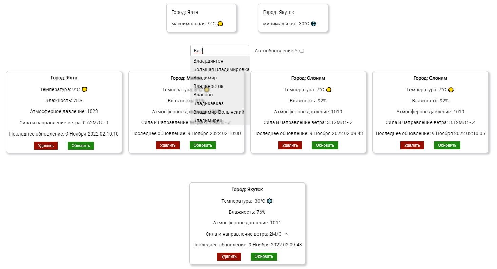

# react weather App

Weather monitoring app. All application controls are located on one screen.

## Screen shot:

### Input field of city's name:

Auto-completion after entering the first 3 characters. When you click on the search result (in the drop-down list) - the city is added to the list of tracked)

### List of tracked cities:

For each item from the list is displayed:

- Temperature;
- Humidity;
- Atmospheric pressure;
- Wind strength and direction;
- Date and time of the last data update;
- The button to delete the selected city;
- The button for updating the selected city.

### Widget:

 Cities are sorted by temperature.
 
 ### Application:
 
 - Locally stores a list of monitored cities (local-storage);
 - Stores a local cache of weather data in monitored cities (local-storage).
 
 List of cities `city.json` is connected locally and stored in the project folder. An open API is used as a data source: https://openweathermap.org.
 
 The application is implemented using React. The visual part is schematic (without design).
